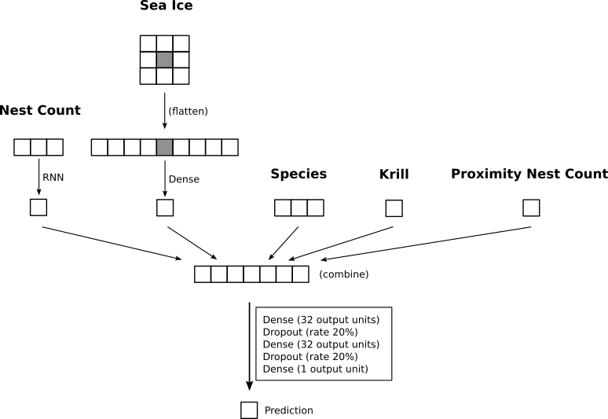

# Random Walk of the Penguins
Competition hosted by [DrivenData.org](https://www.drivendata.org)

## Motivation

DrivenData is hosting competions to tackle import social challenges and launched the _Random Walk of the Penguins_ challenge just when I was looking for a project to implement a neural network myself. I had been reading about neural networks for a while and was curious to give Keras a try. I was not expecting the neural network to perform particulary well for the given problem and was positively surprised about the results.

## Input Data

### Nest Count
The task was to predict the penguin nest counts each year at various lcoations for three different penguin species from 2014 to 2017. I assumed that there is some (shared) mechanism that leads to changes in penguins reproduction and survival and thus in changes in nest counts from one year to the next. I thus converted the nest counts to relative changes (compared to each previous year) for each locations and treated the result as time series.

### Penguin species
Different species will be adapted differently to changing conditions and I would thus expect that the nest count data will depend on the observed species. Instead of building one model for each species, the species information is included in the model.

### Proximity Nest Count change
Some breeding locations of the penguins are found in close priximity and I assumed that this could provide relevant information for the location of intererst. I extracted the nest count change of locations within a specified distance to feed it into the model.

### Sea Ice
It was mentioned on the competion webpage that the sea ice can have an impact on the nest count. Gridded sea ice data was readily available and I was happy to include it into the model as external data source. The data was provided as "image", i.e. that each "pixel" corresponds to the observed sea ice on a square area. For the model, I extracted the sea ice value at each location including the values in direct contact to the "center pixel".

### Krill
The amount of food available might have an impact on breeding. I found some data about the observed krill population and included this information in the model (computing the total observed krill within a given radius). 

## Model

The competition explicitly allowed using external data and I decided to build a model that could take the various sources into account. The following scheme depicts the model of the first submission which scored highest in the end (the source code of the submission can be accessed via the tag S.01). The model is implemented using the [Keras](https://keras.io) library and the [Theano](http://deeplearning.net/software/theano/) backend.

## Loss Function
The nest count observations have varying reliability depending on the observation method. This is taken into account by using an adjusted performance metric (c.f. the relevant [section](https://www.drivendata.org/competitions/47/penguins/page/89/) on the competition page). In order to train the model using this adjusted score, an additional input parameter was fed into the model (not depicted in the model scheme above). This parameter represented the reliability of each observation and adjusted the impact on the total loss ([this](https://github.com/fchollet/keras/issues/2121) helped me a lot in getting this set up).

## Result

The first submission lead to the best result, ranking me surprisingly good as 24th :) 
Working on several models, I could explore the effect different settings had, identify some problems and refine my visualisation strategy to ensure that the predictions "made sense". Interestingly, despite my careful efforts, my successive models started to slightly overfit, leading to lower scores in the final ranking.
